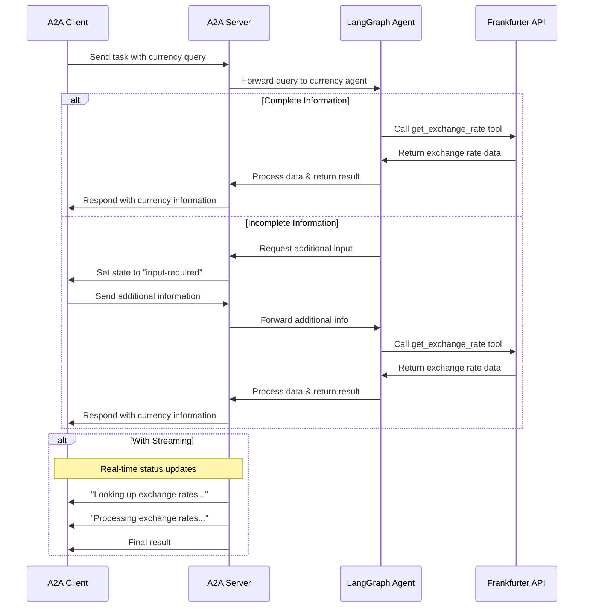

# LangGraph Currency Agent with A2A Protocol

This sample demonstrates a currency conversion agent built with [LangGraph](https://langchain-ai.github.io/langgraph/) and exposed through the A2A protocol. It showcases conversational interactions with support for multi-turn dialogue and streaming responses.

## How It Works

This agent uses LangGraph with LLM (for example Google Gemini..) to provide currency exchange information through a ReAct agent pattern. The A2A protocol enables standardized interaction with the agent, allowing clients to send requests and receive real-time updates.



## Key Features

- **Multi-turn Conversations**: Agent can request additional information when needed
- **Real-time Streaming**: Provides status updates during processing
- **Push Notifications**: Support for webhook-based notifications
- **Conversational Memory**: Maintains context across interactions
- **Currency Exchange Tool**: Integrates with Frankfurter API for real-time rates

## Prerequisites

- Python 3.12 or higher
- [UV](https://docs.astral.sh/uv/)
- Access to an LLM and API Key

## Setup & Running

1. Navigate to the samples directory:

   ```bash
   cd samples/python/agents/langgraph
   ```

2. Create an environment file with your API key:

   ```bash
   If you're using a Google Gemini model (gemini-pro, etc.):
   echo "GOOGLE_API_KEY=your_api_key_here" > .env
  
   
   If you're using OpenAI or any compatible API (e.g., local LLM via Ollama, LM Studio, etc.):

   echo "API_KEY=your_api_key_here" > .env  (not neccessary if have no api key)
   echo "TOOL_LLM_URL=your_llm_url" > .env
   echo "TOOL_LLM_NAME=your_llm_name" > .env

   ```

3. Run the agent:

   ```bash
   # Basic run on default port 10000
   uv run app

   # On custom host/port
   uv run app --host 0.0.0.0 --port 8080
   ```

4. In a separate terminal, run the test client:

   ```bash
   uv run app/test_client.py
   ```

## Build Container Image

Agent can also be built using a container file.

1. Navigate to the `samples/python/agents/langgraph` directory:

  ```bash
  cd samples/python/agents/langgraph
  ```

2. Build the container file

    ```bash
    podman build . -t langgraph-a2a-server
    ```

> [!Tip]  
> Podman is a drop-in replacement for `docker` which can also be used in these commands.

3. Run your container

    ```bash
    podman run -p 10000:10000 -e GOOGLE_API_KEY=your_api_key_here langgraph-a2a-server
    ```

4. Run A2A client (follow step 5 from the section above)

> [!Important]
> * **Access URL:** You must access the A2A client through the URL `0.0.0.0:10000`. Using `localhost` will not work.
> * **Hostname Override:** If you're deploying to an environment where the hostname is defined differently outside the container, use the `HOST_OVERRIDE` environment variable to set the expected hostname on the Agent Card. This ensures proper communication with your client application.

## Technical Implementation

- **LangGraph ReAct Agent**: Uses the ReAct pattern for reasoning and tool usage
- **Streaming Support**: Provides incremental updates during processing
- **Checkpoint Memory**: Maintains conversation state between turns
- **Push Notification System**: Webhook-based updates with JWK authentication
- **A2A Protocol Integration**: Full compliance with A2A specifications

## Limitations

- Only supports text-based input/output (no multi-modal support)
- Uses Frankfurter API which has limited currency options
- Memory is session-based and not persisted between server restarts

## Examples

**Synchronous request**

Request:

```
POST http://localhost:10000
Content-Type: application/json

{
    "id": "12113c25-b752-473f-977e-c9ad33cf4f56",
    "jsonrpc": "2.0",
    "method": "message/send",
    "params": {
        "message": {
            "kind": "message",
            "messageId": "120ec73f93024993becf954d03a672bc",
            "parts": [
                {
                    "kind": "text",
                    "text": "how much is 10 USD in INR?"
                }
            ],
            "role": "user"
        }
    }
}
```

Response:

```
{
    "id": "12113c25-b752-473f-977e-c9ad33cf4f56",
    "jsonrpc": "2.0",
    "result": {
        "artifacts": [
            {
                "artifactId": "08373241-a745-4abe-a78b-9ca60882bcc6",
                "name": "conversion_result",
                "parts": [
                    {
                        "kind": "text",
                        "text": "10 USD is 856.2 INR."
                    }
                ]
            }
        ],
        "contextId": "e329f200-eaf4-4ae9-a8ef-a33cf9485367",
        "history": [
            {
                "contextId": "e329f200-eaf4-4ae9-a8ef-a33cf9485367",
                "kind": "message",
                "messageId": "120ec73f93024993becf954d03a672bc",
                "parts": [
                    {
                        "kind": "text",
                        "text": "how much is 10 USD in INR?"
                    }
                ],
                "role": "user",
                "taskId": "58124b63-dd3b-46b8-bf1d-1cc1aefd1c8f"
            },
            {
                "contextId": "e329f200-eaf4-4ae9-a8ef-a33cf9485367",
                "kind": "message",
                "messageId": "d8b4d7de-709f-40f7-ae0c-fd6ee398a2bf",
                "parts": [
                    {
                        "kind": "text",
                        "text": "Looking up the exchange rates..."
                    }
                ],
                "role": "agent",
                "taskId": "58124b63-dd3b-46b8-bf1d-1cc1aefd1c8f"
            },
            {
                "contextId": "e329f200-eaf4-4ae9-a8ef-a33cf9485367",
                "kind": "message",
                "messageId": "ee0cb3b6-c3d6-4316-8d58-315c437a2a77",
                "parts": [
                    {
                        "kind": "text",
                        "text": "Processing the exchange rates.."
                    }
                ],
                "role": "agent",
                "taskId": "58124b63-dd3b-46b8-bf1d-1cc1aefd1c8f"
            }
        ],
        "id": "58124b63-dd3b-46b8-bf1d-1cc1aefd1c8f",
        "kind": "task",
        "status": {
            "state": "completed"
        }
    }
}
```

**Multi-turn example**

Request - Seq 1:

```
POST http://localhost:10000
Content-Type: application/json

{
    "id": "27be771b-708f-43b8-8366-968966d07ec0",
    "jsonrpc": "2.0",
    "method": "message/send",
    "params": {
        "message": {
            "kind": "message",
            "messageId": "296eafc9233142bd98279e4055165f12",
            "parts": [
                {
                    "kind": "text",
                    "text": "How much is the exchange rate for 1 USD?"
                }
            ],
            "role": "user"
        }
    }
}
```

Response - Seq 2:

```
{
    "id": "27be771b-708f-43b8-8366-968966d07ec0",
    "jsonrpc": "2.0",
    "result": {
        "contextId": "a7cc0bef-17b5-41fc-9379-40b99f46a101",
        "history": [
            {
                "contextId": "a7cc0bef-17b5-41fc-9379-40b99f46a101",
                "kind": "message",
                "messageId": "296eafc9233142bd98279e4055165f12",
                "parts": [
                    {
                        "kind": "text",
                        "text": "How much is the exchange rate for 1 USD?"
                    }
                ],
                "role": "user",
                "taskId": "9d94c2d4-06e4-40e1-876b-22f5a2666e61"
            }
        ],
        "id": "9d94c2d4-06e4-40e1-876b-22f5a2666e61",
        "kind": "task",
        "status": {
            "message": {
                "contextId": "a7cc0bef-17b5-41fc-9379-40b99f46a101",
                "kind": "message",
                "messageId": "f0f5f3ff-335c-4e77-9b4a-01ff3908e7be",
                "parts": [
                    {
                        "kind": "text",
                        "text": "Please specify which currency you would like to convert to."
                    }
                ],
                "role": "agent",
                "taskId": "9d94c2d4-06e4-40e1-876b-22f5a2666e61"
            },
            "state": "input-required"
        }
    }
}
```

Request - Seq 3:

```
POST http://localhost:10000
Content-Type: application/json

{
    "id": "b88d818d-1192-42be-b4eb-3ee6b96a7e35",
    "jsonrpc": "2.0",
    "method": "message/send",
    "params": {
        "message": {
            "contextId": "a7cc0bef-17b5-41fc-9379-40b99f46a101",
            "kind": "message",
            "messageId": "70371e1f231f4597b65ccdf534930ca9",
            "parts": [
                {
                    "kind": "text",
                    "text": "CAD"
                }
            ],
            "role": "user",
            "taskId": "9d94c2d4-06e4-40e1-876b-22f5a2666e61"
        }
    }
}
```

Response - Seq 4:

```
{
    "id": "b88d818d-1192-42be-b4eb-3ee6b96a7e35",
    "jsonrpc": "2.0",
    "result": {
        "artifacts": [
            {
                "artifactId": "08373241-a745-4abe-a78b-9ca60882bcc6",
                "name": "conversion_result",
                "parts": [
                    {
                        "kind": "text",
                        "text": "The exchange rate for 1 USD to CAD is 1.3739."
                    }
                ]
            }
        ],
        "contextId": "a7cc0bef-17b5-41fc-9379-40b99f46a101",
        "history": [
            {
                "contextId": "a7cc0bef-17b5-41fc-9379-40b99f46a101",
                "kind": "message",
                "messageId": "296eafc9233142bd98279e4055165f12",
                "parts": [
                    {
                        "kind": "text",
                        "text": "How much is the exchange rate for 1 USD?"
                    }
                ],
                "role": "user",
                "taskId": "9d94c2d4-06e4-40e1-876b-22f5a2666e61"
            },
            {
                "contextId": "a7cc0bef-17b5-41fc-9379-40b99f46a101",
                "kind": "message",
                "messageId": "f0f5f3ff-335c-4e77-9b4a-01ff3908e7be",
                "parts": [
                    {
                        "kind": "text",
                        "text": "Please specify which currency you would like to convert to."
                    }
                ],
                "role": "agent",
                "taskId": "9d94c2d4-06e4-40e1-876b-22f5a2666e61"
            },
            {
                "contextId": "a7cc0bef-17b5-41fc-9379-40b99f46a101",
                "kind": "message",
                "messageId": "70371e1f231f4597b65ccdf534930ca9",
                "parts": [
                    {
                        "kind": "text",
                        "text": "CAD"
                    }
                ],
                "role": "user",
                "taskId": "9d94c2d4-06e4-40e1-876b-22f5a2666e61"
            },
            {
                "contextId": "a7cc0bef-17b5-41fc-9379-40b99f46a101",
                "kind": "message",
                "messageId": "0eb4f200-a8cd-4d34-94f8-4d223eb1b2c0",
                "parts": [
                    {
                        "kind": "text",
                        "text": "Looking up the exchange rates..."
                    }
                ],
                "role": "agent",
                "taskId": "9d94c2d4-06e4-40e1-876b-22f5a2666e61"
            },
            {
                "contextId": "a7cc0bef-17b5-41fc-9379-40b99f46a101",
                "kind": "message",
                "messageId": "41c7c03a-a772-4dc8-a868-e8c7b7defc91",
                "parts": [
                    {
                        "kind": "text",
                        "text": "Processing the exchange rates.."
                    }
                ],
                "role": "agent",
                "taskId": "9d94c2d4-06e4-40e1-876b-22f5a2666e61"
            }
        ],
        "id": "9d94c2d4-06e4-40e1-876b-22f5a2666e61",
        "kind": "task",
        "status": {
            "state": "completed"
        }
    }
}
```

**Streaming example**

Request:

```
{
    "id": "6d12d159-ec67-46e6-8d43-18480ce7f6ca",
    "jsonrpc": "2.0",
    "method": "message/stream",
    "params": {
        "message": {
            "kind": "message",
            "messageId": "2f9538ef0984471aa0d5179ce3c67a28",
            "parts": [
                {
                    "kind": "text",
                    "text": "how much is 10 USD in INR?"
                }
            ],
            "role": "user"
        }
    }
}
```

Response:

```
{'id': 'ecf66d5d-6bac-423c-b2a0-e5db9cce37fd', 'jsonrpc': '2.0', 'result': {'contextId': '93c45fe2-3f77-46c3-b1ec-b92c7152d707', 'history': [{'contextId': '93c45fe2-3f77-46c3-b1ec-b92c7152d707', 'kind': 'message', 'messageId': 'c7b674a7990841ae8f273358bb3e5e1f', 'parts': [{'kind': 'text', 'text': 'how much is 10 USD in INR?'}], 'role': 'user', 'taskId': 'd0588ec3-1829-411d-abcf-5dfb64bcf302'}], 'id': 'd0588ec3-1829-411d-abcf-5dfb64bcf302', 'kind': 'task', 'status': {'state': 'submitted'}}}

{'id': 'ecf66d5d-6bac-423c-b2a0-e5db9cce37fd', 'jsonrpc': '2.0', 'result': {'contextId': '93c45fe2-3f77-46c3-b1ec-b92c7152d707', 'final': False, 'kind': 'status-update', 'status': {'message': {'contextId': '93c45fe2-3f77-46c3-b1ec-b92c7152d707', 'kind': 'message', 'messageId': '353e5a0f-6053-4285-917f-a1b215f9b065', 'parts': [{'kind': 'text', 'text': 'Looking up the exchange rates...'}], 'role': 'agent', 'taskId': 'd0588ec3-1829-411d-abcf-5dfb64bcf302'}, 'state': 'working', 'timestamp': '2025-08-27T09:14:15.932246+00:00'}, 'taskId': 'd0588ec3-1829-411d-abcf-5dfb64bcf302'}}

{'id': 'ecf66d5d-6bac-423c-b2a0-e5db9cce37fd', 'jsonrpc': '2.0', 'result': {'contextId': '93c45fe2-3f77-46c3-b1ec-b92c7152d707', 'final': False, 'kind': 'status-update', 'status': {'message': {'contextId': '93c45fe2-3f77-46c3-b1ec-b92c7152d707', 'kind': 'message', 'messageId': '8aa89110-99e2-439b-bd5d-5b1e09b6c942', 'parts': [{'kind': 'text', 'text': 'Processing the exchange rates...'}], 'role': 'agent', 'taskId': 'd0588ec3-1829-411d-abcf-5dfb64bcf302'}, 'state': 'working', 'timestamp': '2025-08-27T09:14:18.847692+00:00'}, 'taskId': 'd0588ec3-1829-411d-abcf-5dfb64bcf302'}}

{'id': 'ecf66d5d-6bac-423c-b2a0-e5db9cce37fd', 'jsonrpc': '2.0', 'result': {'artifact': {'artifactId': '60ad3605-618c-4b87-aa1a-3a2eba576419', 'name': 'conversion_result', 'parts': [{'kind': 'text', 'text': '10 USD is 876.2 INR.'}]}, 'contextId': '93c45fe2-3f77-46c3-b1ec-b92c7152d707', 'kind': 'artifact-update', 'taskId': 'd0588ec3-1829-411d-abcf-5dfb64bcf302'}}

{'id': 'ecf66d5d-6bac-423c-b2a0-e5db9cce37fd', 'jsonrpc': '2.0', 'result': {'contextId': '93c45fe2-3f77-46c3-b1ec-b92c7152d707', 'final': True, 'kind': 'status-update', 'status': {'state': 'completed', 'timestamp': '2025-08-27T09:14:20.709764+00:00'}, 'taskId': 'd0588ec3-1829-411d-abcf-5dfb64bcf302'}}
```

## Learn More

- [A2A Protocol Documentation](https://a2a-protocol.org/)
- [LangGraph Documentation](https://langchain-ai.github.io/langgraph/)
- [Frankfurter API](https://www.frankfurter.app/docs/)
- [Google Gemini API](https://ai.google.dev/gemini-api)


## Disclaimer
Important: The sample code provided is for demonstration purposes and illustrates the mechanics of the Agent-to-Agent (A2A) protocol. When building production applications, it is critical to treat any agent operating outside of your direct control as a potentially untrusted entity.

All data received from an external agent—including but not limited to its AgentCard, messages, artifacts, and task statuses—should be handled as untrusted input. For example, a malicious agent could provide an AgentCard containing crafted data in its fields (e.g., description, name, skills.description). If this data is used without sanitization to construct prompts for a Large Language Model (LLM), it could expose your application to prompt injection attacks.  Failure to properly validate and sanitize this data before use can introduce security vulnerabilities into your application.

Developers are responsible for implementing appropriate security measures, such as input validation and secure handling of credentials to protect their systems and users.
